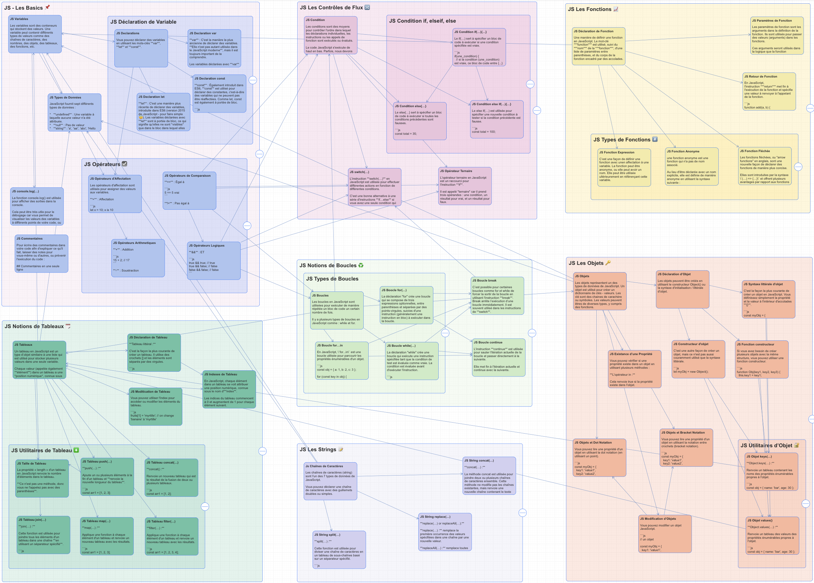

# JavaScript 101

Mohamed Ez-Zaouia
MMI, IUT Lannion

---



---

# JS - Les Basics 📌

---

# JS Variables

Les variables sont des conteneurs qui stockent des valeurs. Une variable peut contenir différents types de valeurs comme des chaînes de caractères, des nombres, des objets, des tableaux, des fonctions, etc.

Les variables en JavaScript sont dynamiquement typées, ce qui signifie qu'une variable peut contenir n'importe quel type de valeur et peut changer de type au cours de l'exécution du programme.

Par exemple, vous pouvez déclarer une variable `x` et lui assigner une valeur initiale de `5`, qui sera traitée comme un nombre.

Ensuite, vous pouvez changer la valeur de `x` pour une chaîne de caractères comme `Hello`, sans avoir à spécifier explicitement le type de données de la variable. Cela rend JavaScript très flexible mais peut parfois entraîner des erreurs si les types de données ne sont pas gérés correctement.

---

# JS Déclaration de Variable

Vous pouvez déclarer des variables en utilisant les mots-clés `var`, `let` et `const`.

---

# JS Declaration let

**let** : C'est une manière plus récente de déclarer des variables, introduite dans ES6 (version 2015 de JavaScript - pour faire simple 😇). Les variables déclarées avec `let` sont à portée de bloc, ce qui signifie qu'elles ne sont _visibles_ que dans le bloc dans lequel elles sont déclarées.

```js
let variableName = "valeur de la variable";
```

---

# JS Declaration var

**var** : C'est la manière la plus ancienne de déclarer des variables. **Elle n'est pas autant utilisée dans le JavaScript moderne**, mais il est toujours important de la comprendre.

Les variables déclarées avec `var` sont à portée de fonction, ce qui signifie qu'elles ne sont _visibles_ que dans la fonction dans lesquelles sont déclarées. (`var` est un peu compliqué que ça, c’est pourquoi il ne faut PAS l’utiliser).

```js
var variableName = "valeur de la variable";
```

---

# JS Declaration const

**const** : Également introduit dans ES6, `const` est utilisé pour déclarer des constantes, c'est-à-dire des variables qui ne peuvent pas être réaffectées. Comme let, const est également à portée de bloc.

```js
const variableName; // SyntaxError: Missing initializer in const declaration

// On doit initialiser une variable déclarée avec const
const variableName = "valeur de la variable"; // Ok

// On initialize une seule fois une variable déclarée avec const
variableName = "valeur de la variable"; // TypeError: Assignment to constant variable.
```

---

# JS Commentaires

Pour écrire des commentaires dans votre code afin d'expliquer ce qu'il fait, laisser des notes pour vous-même ou d'autres, ou prévenir l'exécution du code :

**Commentaires en une seule ligne**

```js
// Commentaires en une seule ligne
```

---

**Commentaires sur plusieurs lignes**

```js
/* 
Commentaires sur 
plusieurs lignes
....
*/
```

---

# JS console.log(…)

La fonction `console.log()` est utilisée pour afficher des sorties dans la console.

Cela peut être très utile pour le débogage car vous permet de visualiser les valeurs des variables à différents points de votre code, ou d'afficher des messages qui vous aident à comprendre le déroulement de l'exécution de votre code.

```js
console.log("Hello JS 101 !"); // affiche "Hello JS 101 !" dans la console
```

---

```js
console.log("Hello", "JS", "101 !");
// affiche "HelloJS101 !" dans la console, concatène les chaines séparées avec ','

// similaire à :
console.log("Hello" + "JS" + "101 !");
// affiche "HelloJS101 !" dans la console, concatène les chaines séparées avec ','

const nom = "Mon nom";
let prenom = "Mon prénom";
console.log("nom, prénom : ", nom, ",", prenom);
// affiche ??
```

---

# JS Types de Données

JavaScript fournit sept différents types de données :

- **undefined** : Une variable à laquelle aucune valeur n'a été attribuée.
- **null** : Pas de valeur
- **string** : 'a', “aa”, 'abc', 'Hello JS 101', “101 JS”
- **number** : 13, -130, 0.314
- **boolean** true, false
- **object :** Une collection de propriétés, sous forme de {… clé1: valeur1 , clé2: valeur, …}.
- **symbol** : Représente un identifiant unique.

---

# JS Opérateurs ☑️

---

# JS Opérateurs d'Affectation

Les opérateurs d'affectation sont utilisés pour assigner des **valeurs** aux **variables**.

**=** : Affectation

```js
let x = 10; // x is 10
```

**+=** : Affectation Addition

```js
let x = 5;
x += 10; // x is 15
```

---

**-=** : Affectation Soustraction

```js
let x = 10;
x -= 5; // x is 5
```

**\*=** : Affectation Multiplication

```js
let x = 5;
x *= 10; // x is 50
```

---

**/=** : Affectation Division

```js
let x = 10;
x /= 5; // x is 2
```

**%=** : Affectation Modulus

```js
let x = 10;
x %= 3; // x is 1
```

**\*\*=** : Affectation Exponentiation

```js
let x = 5;
x **= 2; // x is 25
```

---

# JS Opérateurs Arithmetiques

**+** : Addition

```js
15 + 2; // 17
```

**-** : Soustraction

```js
15 - 2; // 13
```

**\*** : Multiplication

```js
15 * 2; // 30
```

---

**/** : Division

```js
15 / 2; // 7.5
```

**%** : Modulo (Reste)

```js
15 % 2; // 1
```

**++** : Incrémenter

```js
let x = 15;
x++; // x est 16
```

---

\-- : Décrémenter

```js
let x = 35;
x--; // x est 34
```

**\*\*** : Exponentiation

```js
3 ** 2; // 9 = 3 * 3
```

---

# JS Opérateurs de Comparaison

**==** : Égal à

```js
5 == 5 vrai
```

**!=** : Pas égal à

```js
5 != 4 vrai
```

**===** : Strictement égal à (**le type et la valeur sont égaux**)

```js
5 === 5 vrai
```

---

**!==** : Strictement non égal à

```js
  5 !== '5' vrai
```

**>** : Supérieur à

```js
10 > 5 vrai
```

**<** : Inférieur à

```js
5 < 10 vrai
```

---

**>=** : Supérieur ou égal à

```js
10 >= 10 vrai
```

**<=** : Inférieur ou égal à

```js
5 <= 5 vrai
```

---

# JS Opérateurs Logiques

**&&** : ET

```js
true && true; // true
true && false; // false
false && false; // false
```

---

**||** : OU

```js
true || false; // true
false || false; // false
```

**!** : Négation

```js
!true; // false
!false; // true
```

---

# JS Notions de Tableaux 🗓️

---

# JS Tableaux

Un tableau en JavaScript est un type d’objet similaire à une liste qui est utilisé pour stocker plusieurs valeurs dans une seule variable.

Chaque valeur (appelée également **élément**) dans un tableau a une _position numérique_, connue sous le nom d'**index**.

```js
const arr1 = [1, 2, 3];
```

---

Un element d’un tableau peut contenir **des données de n'importe quel type** : nombres, chaînes de caractères, booléens, fonctions, objets, et même d'autres tableaux.

```js
const arr1 = [1, 2, 3];
const arr2 = ["apple", "banana", "cherry"];
const arr3 = ["toto", 3, 2, { a: 2, b: 4 }];
```

---

# JS Déclaration de Tableau

**Tableau littéral :**

C'est la façon la plus courante de créer un tableau. Il utilise des crochets `[]` et les éléments sont séparés par des virgules.

```js
const arr1 = [1, 2, 3];
const arr2 = ["apple", "banana", "cherry"];
const arr3 = ["toto", 3, 2, { a: 2, b: 4 }];
```

---

# JS Moditication de Tableau

Vous pouvez utiliser l'index pour accéder ou modifier les éléments du tableau.

```js
fruits[1] = "myrtille"; // on change 'banane' à 'myrtille'

console.log(fruits[1]); // 'myrtille'
```

---

# JS Indexes de Tableau

En JavaScript, chaque élément dans un tableau se voit attribuer une position numérique, connue sous le nom d'**index**.

Les indices du tableau commencent à 0 et augmentent de 1 pour chaque élément suivant.

---

```javascript
const fruits = ["pomme", "banane", "cerise"];

console.log(fruits[0]); // 'pomme'
console.log(fruits[1]); // 'banane'
console.log(fruits[2]); // 'cerise'
```

Ici, `pomme` est à l'index `0`, `banane` est à l'index `1` et `cerise` est à l'index `2` dans le tableau de fruits.

---

# JS Utilitaires de Tableau ❇️

---

# JS Taille de Tableau

La propriété « length » d'un tableau en JavaScript renvoie le nombre d'éléments dans le tableau.

**Ce n'est pas une méthode, donc vous ne l'appelez pas avec des parenthèses**.

```javascript
const fruits = ["pomme", "banane", "cerise"];

console.log(fruits.length); // 3
```

---

# JS Tableau join(…)

**join(…) :**

Cette fonction est utilisée pour joindre tous les éléments d'un tableau dans une chaîne **en utilisant un séparateur spécifié**.

---

```js
const words = [
  "This",
  "is",
  "a",
  "sample",
  "string",
  "every",
  "word",
  "is",
  "separated",
];

const str = words.join(" "); // séparateur espace

console.log(str); // "This is a  sample string every word is separated";
```

---

# JS Tableau map(…)

**map(…) :**

Applique une fonction à chaque élément d'un tableau et renvoie un nouveau tableau avec les résultats.

```js
const arr1 = [1, 2, 3];
const arr2 = arr1.map((num) => num * 2); // multiplication de chaque élement par 2

console.log(arr2); // [1, 4, 6]
```

---

# JS Tableau push(…)

**push(…) :**

Ajoute un ou plusieurs éléments à la fin d'un tableau et **renvoie la nouvelle longueur du tableau**.

```js
const arr1 = [1, 2, 3];
const length = arr1.push(4, 5);

console.log(length); // 5

console.log(arr1); // [1, 2, 3, 4, 5]
```

---

# JS Tableau concat(…)

**concat() :**

Renvoie un nouveau tableau qui est le résultat de la fusion de deux ou plusieurs tableaux.

```js
const arr1 = [1, 2];
const arr2 = [3, 4];

const arr3 = arr1.concat(arr2);
console.log(arr3); // [1, 2, 3, 4]
```

---

# JS Tableau filter(…)

**filter(…) :**

Applique une fonction à chaque élément d'un tableau et renvoie un nouveau tableau avec les résultats.

```js
const arr1 = [1, 2, 3, 4];
const arr2 = arr1.filter((num) => num % 2 === 0);

console.log(arr2); // [2, 4]
```

---

# JS Les Contrôles de Flux 🔀

---

# JS Condition

Les conditions sont des moyens pour contrôler l'ordre dans lequel les déclarations individuelles, les instructions ou les appels de fonction sont exécutés ou évalués.

Le code JavaScript s'exécute de haut en bas. Parfois, nous devons exécuter certaines parties du code uniquement si certaines conditions sont remplies. Ce mécanisme est appelé **instructions conditionnelles**.

---

Les principles instructions conditionnelles sont : `if(…)`, `else if(…)`, `else`.

D’autres sont : le `switch(…)` et l’`opérateur ternaire`.

---

# JS Condition if, elseif, else

---

# JS Condition if(…){…}

Le if(…) sert à spécifier un bloc de code à exécuter si une condition spécifiée est vraie.

```js
if (une_condition) {
  // si la condition (une_condition) est vraie, ce bloc de code entre {...} sera exécuter
  // bloc de codee
  // ....
}
```

```js
const total = 50;

if (total > 100) {
  console.log("total est > à 100, discount à appliquer");
}
```

---

# JS Condition else if(…){…}

Le else if(…) est utilisée pour spécifier une nouvelle condition à tester si la condition précédente est fausse.

---

```js
const total = 100;

if (total > 100) {
  // la condition total > 100 est fausse, donc on ne rentre pas dans ce bloc
  console.log("total est > à 100, discount de 20% à appliquer");
} else if (total == 100) {
  // la condition total == 100 est vraie, donc on rentre dans ce bloc
  console.log("total est = à 100");
} else if (total > 50) {
  // ...
}
```

---

# JS Condition else{…}

Le `else{…}` sert à spécifier un bloc de code à exécuter si toutes les conditions précédentes sont fausses.

```js
const total = 35;
if (total > 100) {
  // la condition total > 100 est fausse, donc on ne rentre pas dans ce bloc
  console.log("total est > à 100, discount de 20% à appliquer");
} else if (total == 100) {
  // la condition total == 100 est fausse, donc on ne rentre pas dans ce bloc
  console.log("total est = à 100");
} else if (total > 50) {
  /*... */
} else {
  // On rentre donc dans ce bloc car toutes les conditions sont vraies
  console.log("On est dans le ELSE");
}
```

---

# JS switch(…)

L'instruction `switch(…)` en JavaScript est utilisée pour effectuer différentes actions en fonction de différentes conditions.

C'est une bonne alternative à une série d'instructions `if…else` si vous avez une seule condition qui peut entraîner plusieurs résultats possibles.

---

```js
switch(expression) {
  case value1:
    // code à exécuter si l'expression est égale à valeur1
    break;
  case value2:
    // code à exécuter si l'expression est égale à valeur2
    break;

  ...

  default:
    // code à exécuter si l'expression ne correspond à aucun cas
}
```

---

La déclaration `switch` évalue une expression, en associant la valeur de l'expression à une clause case, et exécute les instructions associées à ce cas. Si aucun cas correspondant n'est trouvé, il exécute le code de la clause `defaut`.

Le mot-clé `break` est utilisé pour empêcher le code de passer automatiquement à la clause suivant.

---

```js
const fruit = "pomme";

switch (fruit) {
  case "banane":
    console.log("banane");
    break;
  case "pomme":
    console.log("banane");
    break;
  default:
    console.log("Pas banane, Pas pomme");
}
```

Parce que le fruit est une 'pomme', le message 'pomme' sera affiché sur la console. Si le fruit était une 'banane', il afficherait 'banane'. Si le fruit était autre chose, il afficherait 'Pas banane, Pas pomme'.

---

# JS Opérateur Ternaire

L'opérateur ternaire en JavaScript est un raccourci pour l'instruction `if`.

Il est appelé "ternaire" car il prend trois opérandes : une condition, un résultat pour vrai, et un résultat pour faux.

```js
condition ? expression_Si_True : expression_Si_False;
```

---

```js
const total = 100;

const result = total > 50 ? "total > 50" : "total <= 50";

console.log(result); // affiche "total > 50"
```

---

# JS Les Fonctions 📈

---

# JS Déclaration de Fonction

Une manière de définir une fonction en JavaScript. Le mot-clé `function` est utilisé, suivi du **_nom_** de la **_fonction_**, d'une liste de paramètres entre parenthèses, et du corps de la fonction encadré par des accolades.

```js
// déclaration
function sayHello() {
  console.log("Hello, world!");
}
```

Vous pouvez appeler une fonction en utilisant **_son nom suivi de parenthèses_** :

```js
sayHello(); // affiche ??
```

---

# JS Retour de Fonction

En JavaScript, l'instruction `return` met fin à l'exécution de la fonction et spécifie une valeur à renvoyer à l'appelant de la fonction.

```js
function add(a, b) {
  return a + b; // <- ceci est le retour de la fonction
}
```

Nous pouvons récupérer le retour de la fonction dans une variable :

```js
const total = add(1, 22); // total est 23

console.log("Total est : ", total); // affiche; Total est : 23
```

Nous pouvons également appeler la fonction directement sans stocker son retour dans une variable, mais cela impact la lisibilité du code :

```js
console.log("Total est : ", add(12, 2)); // affiche; Total est : 14
```

---

# JS Paramètres de Fonction

Les paramètres de fonction sont les arguments dans la définition de la fonction. Ils sont utilisés pour passer des valeurs (arguments) dans les fonctions. Ces arguments seront utilisés dans la logique que la fonction implémente.

```js
function logAB(a, b) {
  console.log("a, b : ", a, b);
}

logAB(1, 3); // a, b : 13
logAB(12, 32); // a, b : 1231
```

---

# JS Types de Fonctions #️⃣

---

# JS Fonction Expression

C’est une façon de définir une fonction avec unen affectation à une variable. La fonction peut être anonyme, ou elle peut avoir un nom. Elle peut être utilisée ultérieurement en référençant cette variable.

```js
const getRectArea = function (width, height) {
  return width * height;
};

const area = getRectArea(3, 4);

console.log("area", area);
```

---

# JS Fonction Anonyme

une fonction anonyme est une fonction qui n'a pas de nom associé.

Au lieu d'être déclarée avec un nom explicite, elle est définie de manière anonyme en utilisant la syntaxe suivante :

```js
const myFunction = function () {
  console.log("Je suis une anonymous function !");
};
```

---

# JS Fonction Fléchée

Les fonctions fléchées, ou "arrow functions" en anglais, sont une nouvelle façon de déclarer des fonctions de manière plus concise.

Elles sont introduites par la syntaxe `(…) => {…}` et offrent plusieurs avantages par rapport aux fonctions traditionnelles :

```js
let sayHello = () => {
  console.log("Hello, world!");
};

sayHello(); // Appeler la fonction, ce qui affiche "Hello, world!"
```

---

```js
let add = (a, b) => a + b;

const total = add(11, 2); // total est 13
```

```js
let square = (x) => x * x;

const result = square(15);
```

---

# JS Les Strings 📝

---

# Js Chaînes de Caractères

Les chaînes de caractères (string) sont l'un des 7 types de données de JavaScript.

Vous pouvez déclarer une chaîne de caractères avec des guillemets doubles ou simples.

```js
const str1 = "a";
const str2 = "aa";
const str3 = "abc";
const str4 = "Hello JS 101";
const str5 = "101 JS";
```

---

# JS String split(…)

**split(…) :**

Cette fonction est utilisée pour diviser une chaîne de caractères en un tableau de sous-chaînes basé sur un séparateur spécifié.

```js
const str = "This is a sample string";
const words = str.split(" "); // séparateur espace

console.log(words); // ['This', 'is', 'a', 'sample', 'string'];
```

---

# JS String replace(…)

**replace(…) :** remplace la première occurrence des valeurs spécifiées dans une chaîne par une nouvelle valeur.

```js
const str = "Hello, World!";
const replacedStr = str.replace("World", "Univers");
console.log(replacedStr); // 'Hello, Univers!'
```

---

**replaceAll(…) :** remplace toutes les occurrences.

```js
const str = "Hello, World!";

const replacedAllStr = str.replaceAll("l", "L");
console.log(replacedAllStr); // HeLLo, WorLd!
```

---

Les deux fonctions **replace(…)** et **replaceAll(…)** renvoient une nouvelle chaîne, la chaîne originale reste donc intacte.

```js
const str = "Hello, World!";
const replacedStr = str.replace("World", "Univers");
console.log(replacedStr); // 'Hello, Univers!'

const replacedAllStr = str.replaceAll("l", "L");
console.log(replacedAllStr); // HeLLo, WorLd!

// str est intacte
console.log(str); // Hello, World!
```

---

# JS String concat(…)

**concat(…) :**

La méthode concat est utilisée pour joindre deux ou plusieurs chaînes de caractères ensemble. Cette méthode ne modifie pas les chaînes existantes, mais renvoie une nouvelle chaîne contenant le texte des chaînes jointes.

```js
const str1 = "Hello";
const str2 = "World!";
const result = str1.concat(str2);
console.log(result); // 'HelloWorld!'
```

---

# JS Notions de Boucles ♻️

---

# JS Boucles

Les boucles en JavaScript sont utilisées pour exécuter de manière répétée un bloc de code un certain nombre de fois.

Il y a plusieurs types de boucles en JavaScript comme : while, for, et for..in.

---

# JS Types de Boucles

---

# JS Boucle for…in

En JavaScript, `for...in` est une boucle utilisée pour parcourir les propriétés énumérables d'un objet.

```js
const obj = { a: 1, b: 2, c: 3 };

for (const key in obj) {
  console.log(key + ": " + obj[key]);
}
/*
Affiche :
"a: 1"
"b: 2"
"c: 3" 
*/
```

---

# JS Boocle for(…)

La déclaration `for` crée une boucle qui se compose de trois expressions optionnelles, entre parenthèses et séparées par des points-virgules, suivies d'une instruction (généralement une instruction en bloc) à exécuter dans la boucle.

```js
// pseudocode
for (expression1; expression2; expression3) {
  // bloc de code
}
```

---

```js
// pseudocode
for (initialisation; condition; expression_finale) {
  // bloc de code
}
```

Initialisation : initialisation de la boucle

Condition : condition à tester si true on rentre dans le bloc sinon on sort (arrête la boucle)

Expression_finale : instruction à exécuter à la fin de chaque itération de la boucle

---

```js
let str = "";

for (let i = 0; i < 9; i++) {
  console.log("iteration : ", i, " -> ", str);
  str = str + i;
}

console.log(str);

// le code affiche
/*
"iteration : " 0 " -> " ""
"iteration : " 1 " -> " "0"
"iteration : " 2 " -> " "01"
"iteration : " 3 " -> " "012"
"iteration : " 4 " -> " "0123"
"iteration : " 5 " -> " "01234"
"iteration : " 6 " -> " "012345"
"iteration : " 7 " -> " "0123456"
"iteration : " 8 " -> " "01234567"
"012345678"
*/
```

---

# JS Boucle while(…)

La déclaration `while` crée une boucle qui exécute une instruction spécifiée tant que la condition de test est évaluée comme vraie. La condition est évaluée avant d'exécuter l'instruction.

---

```js
let n = 0;

while (n < 7) {
  // n < 7 est la condition
  // le bloc de code entre { } sera exécuté tant que 'n < 7' est true
  consolelog("iteration ", n);
  n++;
}

console.log(n);

// Ce code affiche
/*
 "iteration " 0
 "iteration " 1
 "iteration " 2
 "iteration " 3
 "iteration " 4
 "iteration " 5
 "iteration " 6
 7
*/
```

---

# JS Boucle continue

L'instruction `continue` est utilisée pour sauter l'itération actuelle de la boucle et passer directement à la suivante.

Elle met fin à l'itération actuelle et continue avec la suivante.

```js
for (let i = 0; i < 10; i++) {
  if (i === 5) {
    continue;
  }
  console.log(i);
}

// Cela affichera les chiffres de 0 à 4 et de 6 à 9 sur la console
```

---

# JS Boucle break

C’est possible pour certaines boucles comme for et while de forcer la sortir de la boucle en utilisant l'instruction `break`. Break arrête l’exécution d’une boucle immédiatement. Il est souvent utilisé dans les instructions de `switch`.

```js
for (let i = 0; i < 10; i++) {
  if (i === 5) {
    // <-- condition
    break; // <-- !!
  }
  console.log(i);
}
// Cela affichera les nombres de 0 à 4 sur la console
```

---

# JS Les Objets 🔑

---

# JS Objets

Les objets représentent un des types de données de JavaScript. Un objet est utilisé pour créer un dictionnaire de clés - valeurs. Les clé sont des chaines de carachère ou symboles. Les valeurs peuvent êtres de diverses types, y compris des fonctions.

Les objets peuvent être créés en utilisant le constructeur Object() ou la syntaxe d'initialisation / littérale d'objet.

---

# JS Déclaration d’Objet

Les objets peuvent être créés en utilisant le constructeur Object() ou la syntaxe d'initialisation / littérale d'objet.

---

# JS Constructeur d'objet

C'est une autre façon de créer un objet, mais ce n'est pas aussi couramment utilisé que la syntaxe littérale.

```js
let myObj = new Object();

obj.key1 = "value1";
obj.key2 = "value2";
obj.key3 = "value3";
```

---

# JS Fonction constructeur

Si vous avez besoin de créer plusieurs objets avec la même structure, vous pouvez utiliser une fonction constructeur.

```js
function Obj(key1, key2, key3) {
  this.key1 = key1;
  this.key2 = key2;
  this.key3 = key3;
}

let myObj = new Obj("value1", "value2", "value3");
```

---

# JS Syntaxe littérale d'objet

C'est la façon la plus courante de créer un objet en JavaScript. Vous définissez simplement la propriété et la valeur à l'intérieur d'accolades `{}`.

---

# JS Objets et Dot Notation

Vous pouvez lire une propriété d'un objet en utilisant la dot notation (en utilisant un point).

```js
const myObj = {
  key1: "value1",
  key2: "value2",
  key3: "value3",
};

console.log(myObj.key1); // Affiche : 'value1'
// similaire à
const val1 = myObj.key1;
console.log(val1); // Affiche : 'value1'
```

---

# JS Objets et Bracket Notation

Vous pouvez lire une propriété d'un objet en utilisant la notation entre crochets (bracket notation).

```js
const myObj = {
  key1: "value1",
  key2: "value2",
  key3: "value3",
};
console.log(myObj["key1"]); // Affiche : 'value1'
// similaire à
const val1 = myObj["key1"];
console.log(val1); // Affiche : 'value1'
```

---

```js
const myObj = {
  key1: "value1",
  key2: "value2",
  key3: "value3",
  key4: 3,
  key5: [1, 3, 2],
  key6: ["toto", 3, 2, { a: 2, b: 4 }],
  greet: function () {
    console.log("Bonjour, my name is " + this.name);
  },
};
```

Notez que `greet` est une clé qui a comme valeur une fonction.
key4 a comme valeur un nombre
key5 a comme valeur un tableau
key6 a comme valeur un tableau qui lui a différents types de valeurs

---

# JS Existance d’une Propriété

Vous pouvez vérifier si une propriété existe dans un objet en utilisant plusieurs méthodes :

---

**L'opérateur in :**

Cela renvoie true si la propriété existe dans l'objet.

```js
const obj = {
  key1: "value1",
  key2: "value2",
};

console.log("key1" in obj); // true
console.log("key3" in obj); // false
```

---

**La méthode hasOwnProperty :**

Cela renvoie true si l'objet possède la propriété spécifiée en tant que sa propre propriété (non héritée).

```js
const obj = {
  key1: "value1",
  key2: "value2",
};

console.log(obj.hasOwnProperty("key1")); // true
console.log(obj.hasOwnProperty("key3")); // false
```

---

**Accès direct à la propriété :**

Cela vérifie si la valeur de la propriété est undefined. Cependant, cette méthode peut donner des faux négatifs si la propriété existe mais que sa valeur est définie sur undefined.

```js
const obj = {
  key1: "value1",
  key2: "value2",
};

console.log(obj.key1 !== undefined); // true
console.log(obj.key3 !== undefined); // false
```

---

# JS Modification d’Objets

Vous pouvez modifier un objet JavaScript.

```js
// un objet

const myObj = {
  key1: "value1",
  key2: "value2",
  key3: "value3",
};
```

---

**Modification**

Mettre à jour les propriétés d'un objet en utilisant la notation point ou la notation crochet.

**Modification avec la notation point**

```js
myObj.key1 = "new value 1";

console.log(myObj.key1); // Affiche : 'new value 1'
```

---

**Modification avec la notation crochet**

```js
myObj["key1"] = "new value 2";

console.log(myObj["key1"]); // Affiche : 'new value 2'

console.log(myObj.key1); // Affiche : 'new value 2'
```

---

**Ajout**

**Avec la notation point**

```js
myObj.key4 = "value4";

console.log(myObj.key4); // Affiche : 'value4'
```

**Avec la notation crochet**

```js
myObj["value5"] = "value5";

console.log(myObj["key5"]); // Affiche : 'value5'
```

---

**Suppression**

```js
delete myObj.key5;

console.log(myObj.key5); // Affiche : undefined
```

---

# JS Utilitaires d’Objet 🔐

---

# JS Objet keys(…)

**Object.keys(…) :**

Renvoie un tableau contenant les noms des propriétés énumérables propres à l'objet.

```js
const obj = { name: "bar", age: 30 };

const keys = Object.keys(obj);

console.log(keys); // ['name', 'age']
```

---

# JS Objet values()

**Object.values(…) :**

Renvoie un tableau des valeurs des propriétés énumérables propres à l'objet.

```js
const obj = { name: "bar", age: 30 };

const values = Object.values(obj);

console.log(values); // ['bar', 30]
```

---


# Happy Coding!
